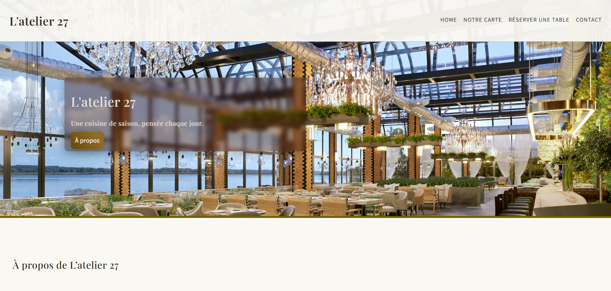

# L'atelier 27

Site vitrine présentant un restaurant fictif : L'atelier 27.

## 🎯 Objectif
Présenter clairement l’activité, les services et permettre une prise de contact simple.
Le site est volontairement léger, rapide à charger et accessible.

## 🖥️ Aperçu

## 🛠️ Technologies utilisées
- HTML
- CSS
- JavaScript

## ✨ Fonctionnalités
- Page d’accueil avec section hero
- Section À propos
- Section Carte/Services
- Formulaire ou moyen de contact
- Design responsive (mobile / desktop)

## 📁 Structure du projet
- `/index.html` : structure principale
- `/style.css` : styles
- `/script.js` : interactions
- `/images` : images

## 🚀 Installation et lancement
1. Cloner le dépôt
2. Ouvrir `index.html` dans un navigateur  
   ou utiliser un serveur local si nécessaire

## 📌 Améliorations possibles
- Ajout d’animations
- Optimisation SEO
- Connexion à un backend pour le formulaire

## 👤 Auteur
Amélie Humeau
